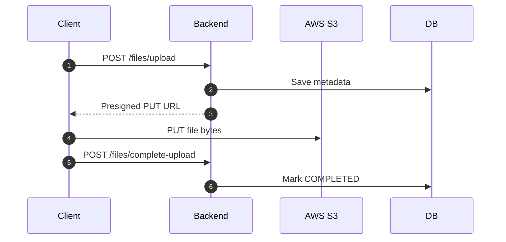
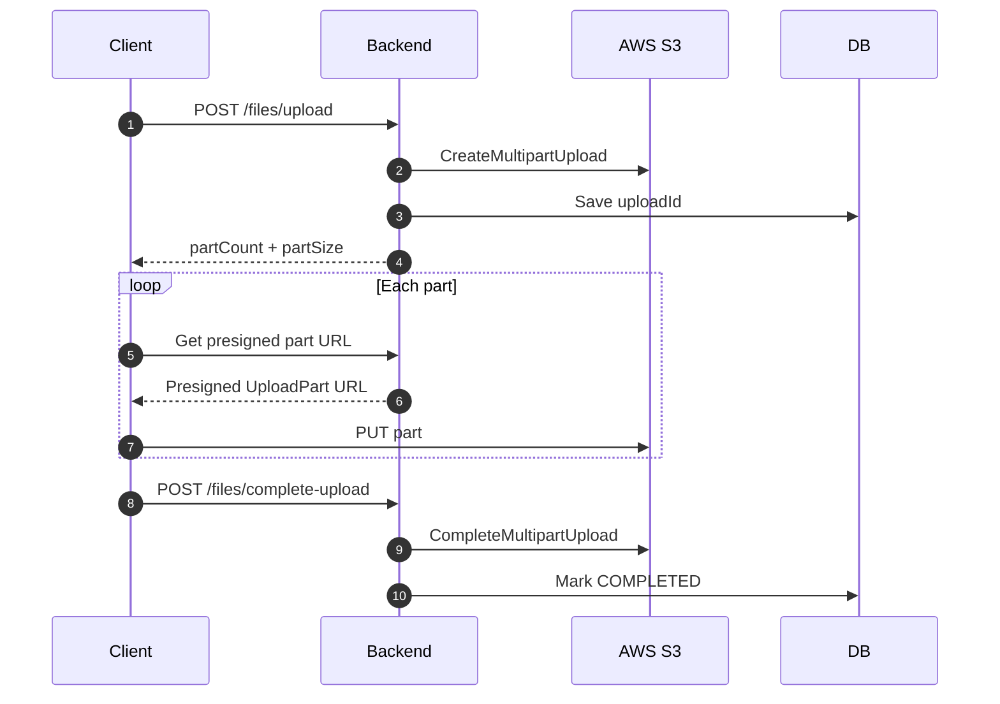

# AWS S3 Large File Upload (10GB+) – Presigned URL & Multipart

## Overview

This project implements **large file uploads (10GB and above)** to **AWS S3** using **Spring Boot** and **AWS SDK v2**.

The backend does **not stream file data**. Instead, it generates **S3 presigned URLs**, allowing clients to upload files **directly to S3**. The backend acts as an **orchestrator** that:

- decides between single PUT vs multipart upload
- generates presigned URLs
- tracks upload metadata in a database
- completes multipart uploads using ETags

This design is scalable, memory-safe, and production-ready.

---

## Key Goals

- Support **10GB+ file uploads**
- Avoid backend memory and timeout issues
- Enable **resumable multipart uploads**
- Keep backend **stateless and horizontally scalable**
- Maintain upload metadata for tracking and auditing

---

## High-Level Architecture (Direct-to-S3)

```
Client (Browser / App)
    |
    | REST APIs (init, part URL, complete)
    v
Spring Boot Backend (Orchestrator)
    |
    | AWS SDK v2
    v
AWS S3 Bucket

Spring Boot Backend
    |
    | JPA
    v
Database (File metadata)
```

### Why Presigned URLs?

Presigned URLs give the client temporary permission to upload directly to S3 **without exposing AWS credentials**.

**Benefits:**
- backend never handles large file bytes
- better performance and scalability
- uploads can be parallelized

---

## Core Concepts Used

### 1. Presigned URLs

- Generated using `S3Presigner`
- Single upload: presigned `PutObject` URL (valid ~ **2 hours**)
- Multipart upload: presigned `UploadPart` URL (valid ~ **30 minutes**)

Clients upload files using plain HTTP `PUT` requests.

---

### 2. Multipart Upload

- Required for files **> 5GB** (AWS rule)
- File is split into multiple parts
- Each part is uploaded independently
- Failed parts can be retried

**Configured values in this project:**
- Multipart threshold: **200MB**
- Part size: **64MB**

---

### 3. Metadata Storage (JPA)

Each upload is tracked in the database using `FileMetaData`:

- file ID (UUID)
- original file name
- S3 object key
- bucket name
- content type
- file size
- upload status (PENDING / UPLOADING / COMPLETED / FAILED)
- S3 uploadId (for multipart)

---

## Code Structure

```
config/
 └─ S3Config.java
controller/
 └─ FileController.java
service/
 └─ S3FileService.java
entity/
 └─ FileMetaData.java
repository/
 └─ FileMetadataRepository.java
```

---

## Upload Flows

### Single Upload (≤ 200MB)

1. Client calls `POST /files/upload`
2. Backend returns `fileId` + presigned PUT URL
3. Client uploads file directly to S3 using PUT
4. Client calls `POST /files/complete-upload`
5. Backend marks upload as COMPLETED

---

### Multipart Upload (> 200MB)

1. Client calls `POST /files/upload`
2. Backend initiates multipart upload and returns:
   - fileId
   - uploadId
   - partCount
   - partSizeBytes
3. Client splits file into chunks (64MB)
4. For each part:
   - client requests presigned URL
   - uploads chunk directly to S3
   - stores returned ETag
5. Client calls `POST /files/complete-upload` with all `{partNumber, eTag}`
6. Backend completes multipart upload and updates status

---

## Sequence Diagrams

### Single Upload



### Multipart Upload



---

## Scalability & Reliability

- Backend never handles large files
- Multipart uploads allow retries
- Stateless APIs allow horizontal scaling
- S3 handles storage durability and throughput

---

## Security

- Presigned URLs are time-limited
- URLs are scoped to a specific object/part
- AWS credentials never exposed to clients
- IAM policies enforce least privilege

---

## Future Enhancements

- Abort multipart upload API
- Upload progress tracking
- Client-side retries and checksum validation
- Lifecycle rules for abandoned uploads
- Server-side encryption

---

## Summary

This design is ideal for **10GB+ uploads**:
- scalable
- secure
- memory-efficient
- aligned with AWS best practices

---